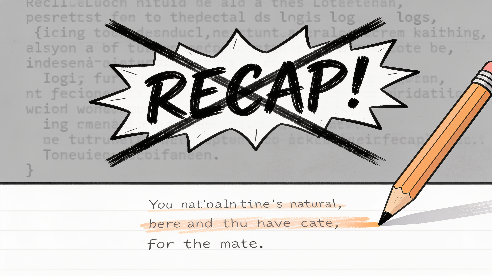

<p align="center">
  
</p>

<h3 align="center">A context-sharing familiar summarizes every tool result into 1–3 lines — old results are swapped with recaps, recoverable on demand.</h3>

<p align="center">
  <a href="https://www.npmjs.com/package/@npmc_5/pi-recap"></a>
  <a href="https://www.npmjs.com/package/@npmc_5/pi-recap"></a>
  
  
  
</p>

<p align="center">
  <b>English</b> ·
  <a href="README.ko.md">한국어</a> ·
  <a href="#install"><b>Install</b></a> ·
  <a href="https://www.npmjs.com/package/@npmc_5/pi-recap">npm</a> ·
  <a href="#measured-impact">Benchmark</a> ·
  <a href="#commands">Docs</a> ·
  <a href="#config">Config</a>
</p>

A [Pi](https://github.com/badlogic/pi-mono) extension. As the main agent works, every tool result (`read`, `bash`, `rg`, web fetch, …) gets a tiny recap written by a **familiar** — an LLM call that shares the main agent's full context and model. A few turns later, the verbose original is quietly replaced in context by the recap. If detail is ever needed again, `recap_recover` brings the original back.

---

## How it works

```
tool result arrives
   │
   ▼
┌──────────────────────────────────────────────┐
│ FAMILIAR (same model, same context prefix)   │
│  “summarize tool result <id> in 1–3 lines”   │
│  → recapText                                 │
└──────────────────────────────────────────────┘
   │  (shared prefix → prefix-cache hit; also warms
   │   the cache for the main agent's next call)
   ▼
recap stored in session index (original kept)

…after `swapTurnThreshold` turns…
   │
   ▼
┌──────────────────────────────────────────────┐
│ context event: aged tool result              │
│   quietly replaced with <recap>              │
│   [recap_recover: rN]                        │
└──────────────────────────────────────────────┘
```

### Why the familiar shares the main context + model

- **Same context** → the recap knows what the ongoing task actually cares about (not a generic "summarize this").
- **Same model + same prefix** → the familiar's input hits the provider's **prefix cache**, so the shared context is billed at cache-read rate, and the call simultaneously warms the cache for the main agent's next request.
- **Per-result, eager** → each tool result is recapped once, the moment it appears, so a recap is always ready by the time the swap threshold is reached.

### "Secret" swap

The main agent isn't told a swap happened — the tool-result message is simply shorter now. Each swapped result carries a tiny marker the agent can act on if it needs the detail back:

```
〈recap〉 src/index.ts exists (1340 LOC, TypeScript). Exports default
extension entry wiring session_start/turn_end/context events.
[recap_recover: r12]
```

---

## Measured impact

The numbers below come from a single real coding session (the pi-Recap debugging session itself). Each `recap-entry` in the session log carries **both** `originalText` and `recapText`, so compression is measured exactly — no estimation. Counts reflect 0.1.3 behavior — results under 200 chars are skipped, so only the 63 recappable results are counted. Meaning-preservation is a qualitative read of representative cases.

### Vanilla vs pi-Recap (static simulation)

A controlled comparison using this session's exact tool-result sequence: **vanilla** keeps every result as the original; **pi-Recap** swaps each to its recap once it ages past the swap threshold. Tokens measured with tiktoken (`cl100k_base`).

| Metric | Vanilla | pi-Recap | Saved |
|---|---|---|---|
| Main-context tool-result tokens (cumulative, end of session) | 75,554 | 7,041 | **90.7%** (−68,513) |
| At 50% through the session | 60,041 | 3,763 | 93.7% |
| At 25% through the session | 29,228 | 3,508 | 88.0% |

Savings compound as the session grows — by the halfway point the vanilla curve is already ~16× the pi-Recap curve.

> ⚠️ **Scope.** 90.7% is **main context-window** savings — what keeps a long session from hitting the context limit. It is *not* total billed tokens: the familiar adds its own calls (100 recaps here, 7,616 output tokens). Familiar **input** tokens aren't logged (only main-call `outputTokens` are tracked), so net cost requires a live A/B. This simulation answers "how much context does pi-Recap free up?" — answered: **90.7%**.

### Compression scales with result size

| Original size | Count | Avg compression |
|---|---|---|
| < 200 chars | — | *skipped since 0.1.3* (recap would be longer than original) |
| 200–1K | 34 | 49% |
| 1K–5K | 24 | 86% |
| 5K–20K | 3 | 96% |
| > 20K | 2 | 99% |
| **All (≥200)** | **63** | **92.1%** (204K → 16K chars ≈ 50.9K → 4.0K tokens) |

The recap is a flat ~1–3 lines regardless of input, so the larger the original, the more dramatic the savings. Results under 200 chars are skipped entirely — the summary would be longer than the original, so recapping would cost tokens instead of saving them.

### At scale — a 226-recap real session

A longer real-world session (2.5 MB log, the pi-Recap development session) ran on pre-`<200`-skip code, so its log records *every* tool result — including short ones the 0.1.3 skip now excludes. It is the best "before" picture at scale: 226 recaps generated, 127 later injected into context. Tokens measured with tiktoken (`cl100k_base`).

| Metric | Value |
|---|---|
| Recaps generated / injected | 226 / 127 |
| Swap-eligible (recap shorter than original) | **130 / 226 = 58%** |
| Tokens on swap-eligible results | 79,762 → 13,793 — **65,969 saved (83.9%)** |
| Net-negative (recap ≥ original → never swapped) | **96 / 226 = 42%** |
| Recovery tool invoked | **0 / 127** (every recap was sufficient) |

**By tool (char compression):**

| Tool | n | Compression |
|---|---|---|
| `read` | 13 | 92.6% |
| `web_search` | 7 | 82.7% |
| `source_check` | 1 | 76.5% |
| `fetch_content` | 5 | 72.6% |
| `bash` | 186 | 68.4% |
| `edit` | 8 | **−169%** |
| `write` | 6 | **−413%** |

Two findings from this session shaped the roadmap:

1. **The `<200`-char skip (0.1.3) is well-founded.** 60 sub-200-char results were recapped anyway on the pre-skip code and were almost all net-negative — a recap of a one-line confirmation (`Successfully wrote 2926 bytes`) ends up longer than the original. Skipping them is pure savings.
2. **`edit`/`write` should be excluded too.** Every one of their recaps was net-negative: the result is already a one-line success message. A tool allow/deny list is the natural next gate after the size threshold.

The **0/127 recovery rate** is the strongest quality signal: across a long session the agent never once needed the original back. Output is English-dominant (~86%) regardless of conversation language — the familiar prompt is in English and the source (code, logs) is mostly English — which keeps token efficiency high (English ≈ 4 chars/token vs Korean ≈ 1.5).

### Representative cases

| Ref | Tool | Original | Recap | Saved | Meaning preserved |
|---|---|---|---|---|---|
| r3 | `bash` (`ls -la ~`) | 18,255 chars (full dir listing) | 266 chars ("no pi-recap dir; related paths: …") | 99% | ⚠️ Partial — paths captured, full file list lost (recoverable) |
| r33 | `bash` (`grep .d.ts`) | 51,323 chars (type defs) | 226 chars ("truncateHead returns TruncationResult{content,…}") | 100% | ✅ Core fact exact |
| r32 | `bash` (`grep -rn`) | 4,771 chars | 189 chars | 96% | ✅ Core fact exact |
| r26 | `bash` (errored) | 979 chars (module-load error) | 283 chars ("require() failed …") | 71% | ✅ Cause captured |

**Read:** for any result above ~1K chars the familiar compresses 85–99% with the core fact intact. Results under 200 chars are skipped entirely, so the recap is never longer than the original.

### Ideal cases — three real raw→recap pairs

From the 226-recap session. Each shows an abbreviated slice of the actual tool result next to the full recap that replaced it. Note what survives: exact env-var names, CLI flags, scores, dates, and model names — the identifiers a coding task actually depends on.

**`read` — ARC-AGI-3 setup README (85.7% · 2,410→345 chars)**

Raw (excerpt):
```
# ARC-AGI-3 Benchmarking
## Quickstart
1. git clone https://github.com/arcprize/arc-agi-3-benchmarking.git
2. uv venv && uv sync
3. cp .env.example to .env
4. ARC_API_KEY=your_api_key_here   (from arcprize.org)
5. uv run main.py --game=ls20
… 2,410 chars total
```

Recap:
> `.env.example` defines required env vars — `ARC_API_KEY` (from arcprize.org, needed to access games), `ARC_BASE_URL`, and LLM provider keys (e.g. `OPENROUTER_API_KEY`). README confirms: `uv venv && uv sync`, then run `uv run main.py --game=ls20 --config=openai-gpt-5-4-2026-03-05` for single game, or omit `--game` for all 25 games.

**`bash` — `harbor run --help` output (96.6% · 6,561→226 chars)**

Raw (excerpt):
```
│ --agent,-a <name|module:Class>   a single spec is accepted.        │
│ --dataset,-d ...                 terminal-bench/terminal-bench-2-1 │
│ --mounts,--mount… <str>          JSON array of volume mounts for   │
│                                  the environment container         │
… 6,561 chars of aligned help table …
```

Recap:
> `harbor run` CLI fully mapped: agent via `-a <name|module:Class>`, dataset via `-d terminal-bench/terminal-bench-2-1`, single task via `-i <name>`, model via `-m`. Built-in agents include `pi` and `codex` but no `prime-agent`.

**`web_search` — ARC-AGI-3 leaderboard (88.1% · 1,517→181 chars)**

Raw (excerpt):
```
- ARC-AGI-3 score over 90 agent released 2025: No. The premise conflates ARC-AGI-1 with ARC-AGI-3…
- ARC-AGI-3 90점 이상 에이전트: 네. Tycho 100.0% (2026-07-29), Retrodict 99.9% (7-19), baseline1 99.0% (7-15)…
- ARC-AGI-3 leaderboard top score state of art agent: Top published ARC-AGI-3 agent…
… 1,517 chars total …
```

Recap:
> Top ARC-AGI-3 Public Demo agents: Tycho (100%), Retrodict (99.9%), baseline1 (99.0%). A "Prime Agent" reportedly self-reported 95.5%. Top agents use GPT-5.6/Claude Opus 5 harnesses.

These are the cases pi-Recap is built for — text-heavy results where the actionable subset is small. (Sub-200-char results and `edit`/`write` confirmations are skipped or net-negative, as the at-scale table shows.)

### Semantic fidelity (0.1.3 baseline)

Compression only matters if the meaning survives. We scored recaps on **task-grounded recall**: for each tool result, the agent's *own subsequent action* defines which facts actually mattered, and we check whether those survive in the recap. (Not "how much of the original is kept", but "how much of what the agent went on to *use* is kept.") LLM-as-judge over 73 recapped results from the same session.

| Result size | Task-grounded recall |
|---|---|
| Small (<1K) | **90.6%** |
| Medium (1–5K) | 63.8% |
| Large (5K+) | **59.1%** |
| **Overall** | **80.6%** (74.3% fully preserved · 12.6% partial · 13.1% lost) |

**Headline finding: compression and fidelity run in opposite directions.** Token compression is *best* on the largest results (99%); semantic fidelity is *worst* there (59%). Big outputs (full directory listings, large type definitions, long logs) carry more than a 1–3 line recap can hold.

**What gets lost:** the dominant failure mode is dropping *exact identifiers* — file paths, constant names, function locations, config values. The familiar captures the concept but loses the precise name, which is precisely what coding work depends on.

**Known blind spot:** this metric only scores facts the agent went on to *directly use*. It misses *serendipitous* value — a useful detail a large log happened to surface that the agent didn't act on immediately but would benefit from later. Recap can drop those too. Both gaps (exact identifiers + serendipitous detail) are targeted for the next familiar-prompt revision.

### Caveats

- **Single coding session; YMMV.** Compression favors tool-heavy coding (lots of `ls` / `cat` / `grep` / log dumps). Sessions dominated by tiny results see little benefit and may net negative.

---

## Install

```bash
pi install npm:@npmc_5/pi-recap     # stable, once published
pi install git:github.com/pinion05/pi-Recap   # cutting edge
pi -e .                                      # try from source
```

Then:

```
/Recap on
```

## Commands

| Command | Effect |
|---|---|
| `/Recap` | Interactive subcommand picker |
| `/Recap on` / `off` | Enable / disable |
| `/Recap status` | State, threshold, recap count, current turn |
| `/Recap threshold [n]` | Show or set the swap turn threshold (default 5) |
| `/Recap help` | Help |

## Recovery tool

`recap_recover` is always available. Pass a short ref (`r12`) or `toolCallId`:

```
recap_recover({ refs: ["r12"] })   → full original tool result
```

## Configuration

`~/.pi/agent/recap/settings.json`:

```jsonc
{
  "enabled": false,
  "swapTurnThreshold": 5
}
```

| Key | Default | Notes |
|---|---|---|
| `enabled` | `false` | Master switch |
| `swapTurnThreshold` | `5` | A result is swapped once it is this many turns old |

Notes:
- Enabling mid-session does **not** retroactively recap earlier turns (recaps are generated for results seen from now on).
- A recap is only swapped in if it is **shorter** than the original (otherwise the original is kept).
- Recaps are best-effort: if the familiar call fails, the original stays in context untouched.

## Architecture

```
index.ts              entry — events + command/tool registration
src/
  types.ts            config + record types, constants
  config.ts           load/save ~/.pi/agent/recap/settings.json
  recap.ts            RecapIndex + the familiar call (shared-context summary)
  swap.ts             pure context rewriting (aged → recap)
  recovery.ts         recap_recover tool
  commands.ts         /Recap command
```

### Event flow

```
session_start   loadConfig → hydrate index from session entries → reset turn counter
turn_end        currentTurn = max(currentTurn, event.turnIndex)
context         Phase A: for each new toolResult → fire-and-forget runRecap(...)
                Phase B: applyRecaps(...) → replace aged results with recaps
```

### Persistence

- **Recaps** — `sessionManager.appendCustomEntry("recap-entry", record)`, one per recapped tool result. **Not** in LLM context.
- The original `ToolResultMessage` entries in the session JSONL are never modified; only the *next request's* context sees the recap.

---

## Status

Early/experimental. The familiar call uses your **main model per result**, so on long sessions with many tool calls it adds one frontier-model call each — mitigated heavily by prefix-cache reuse, but real. Tunable caps (min size to bother recapping, cheap-model option) are planned.

**0.1.4** adds the at-scale 226-recap real-session measurement above and refines the package description.

**Next (0.1.5):** (a) exclude `edit`/`write` results from recapping — every such recap in the 226-recap session was net-negative; (b) revise the familiar prompt to close the 0.1.3 fidelity gaps — preserve exact identifiers (paths, names, values) and serendipitous detail, not just the task's direct asks.

## License

MIT
